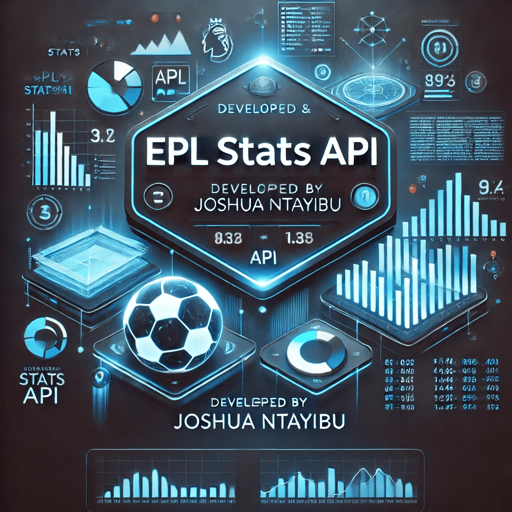
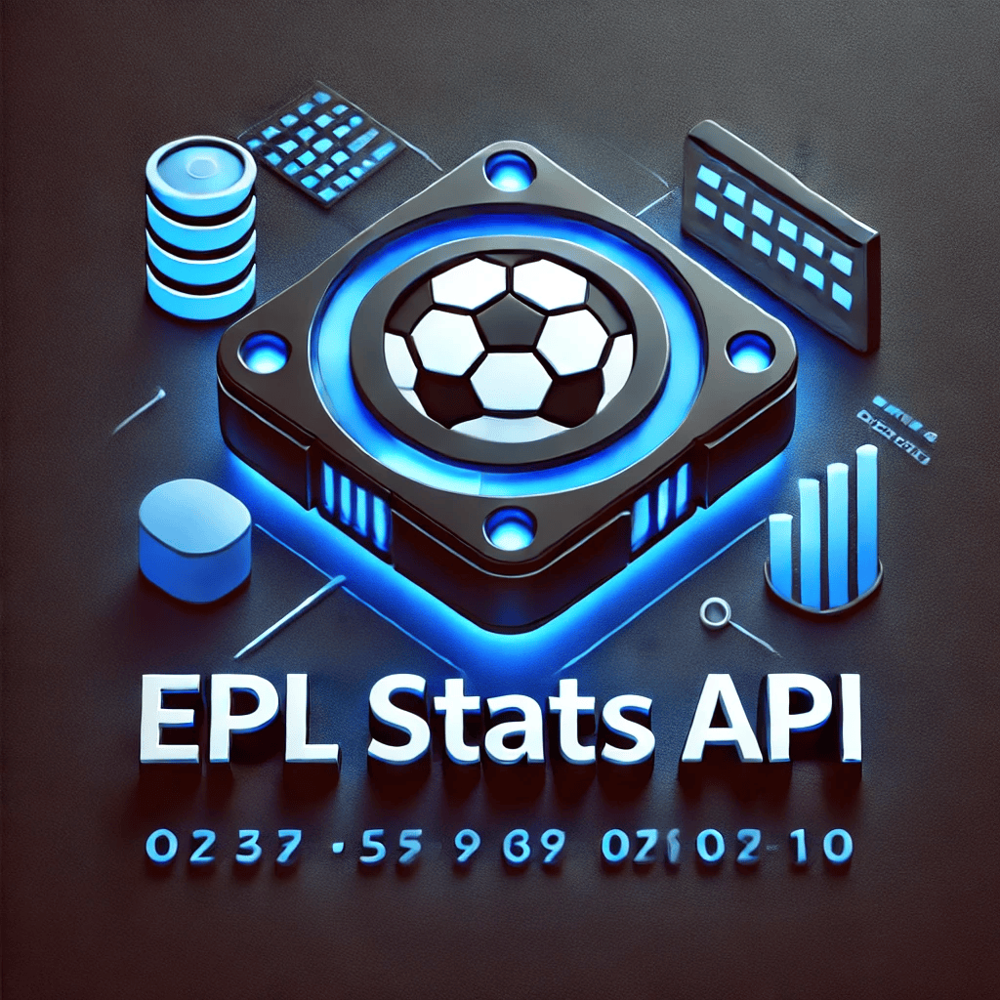

# EPL Stats API




⚽ A powerful API for fetching English Premier League stats, optimized with caching and pagination.


# EPL Stats API


⚽ A powerful API for fetching English Premier League stats, optimized with caching and pagination.

## Features
- 🏆 Fetch player & team stats
- 📊 Real-time analytics
- ⚡ Fast, optimized queries

to:

this , don't remove a single line from this way it is:

# 🏆 Premier League Stats API

## 📌 Overview
The **Premier League Stats API** is a RESTful API built with **Spring Boot** and **PostgreSQL**, designed to provide comprehensive player statistics from the **English Premier League (EPL)**. It allows users to retrieve player data, filter by team, position, nationality, and various performance metrics.

## 🚀 Features
✅ Retrieve all player statistics  
✅ Filter players by **team, position, nationality, goals, and assists**  
✅ Supports **pagination and sorting** for large datasets  
✅ Uses **Spring Boot, PostgreSQL, and JPA** for efficient data management  
✅ Integrated **Swagger UI** for easy API documentation and testing

---

## 🔧 Technologies Used
- **Java 21** (Spring Boot 3.2.2)
- **PostgreSQL 17**
- **Maven** (Dependency Management)
- **Swagger UI** (API Documentation)
- **Docker** (Optional Deployment)

---

## 🎯 API Endpoints

### **📌 Get All Players**
📍 `GET /api/v1/player`

#### **Query Parameters (Optional)**

| Parameter | Type   | Description                                      |
|-----------|--------|--------------------------------------------------|
| `team`    | string | Filter by team name (`Arsenal`, `Chelsea`, etc.) |
| `position`| string | Filter by position (`FW`, `MF`, `DF`, `GK`)      |
| `nation`  | string | Filter by nationality (`ENG`, `BRA`, `FRA`)      |
| `gls`     | int    | Minimum number of goals scored                   |
| `ast`     | int    | Minimum number of assists                        |

#### **Example Request:**
```bash
curl -X GET "http://localhost:8080/api/v1/player?team=Arsenal&position=FW"


#### **Example Response:**
[
  {
    "id": 5,
    "name": "Gabriel Jesus",
    "nation": "BRA",
    "pos": "FW",
    "age": 25,
    "mp": 14,
    "starts": 14,
    "min": 1219.0,
    "gls": 5,
    "ast": 5,
    "team": "Arsenal"
  }
]

#### **📌 Get Player by ID:**
📍 GET /api/v1/player/{id}
Example Request:
curl -X GET "http://localhost:8080/api/v1/player/5"

#### ** Response:**
{
  "id": 5,
  "name": "Gabriel Jesus",
  "nation": "BRA",
  "pos": "FW",
  "age": 25,
  "mp": 14,
  "starts": 14,
  "min": 1219.0,
  "gls": 5,
  "ast": 5,
  "team": "Arsenal"
}


#### ** ✏️ Add a New Player:**
📍 POST /api/v1/player
Example Request Body:
{
  "name": "John Doe",
  "nation": "USA",
  "pos": "MF",
  "age": 27,
  "mp": 12,
  "starts": 10,
  "min": 1045.0,
  "gls": 3,
  "ast": 2,
  "team": "Chelsea"
}

### **📌 Headers: Content-Type: application/json: **
📌 Response: 201 Created

### ** 🛑 Delete Player by ID: **
📍 DELETE /api/v1/player/{id}

Example Request:
curl -X DELETE "http://localhost:8080/api/v1/player/5"

📌 Response: 200 OK - Player deleted successfully

### ** 📘 Swagger API Documentation **
Swagger UI is integrated for interactive API testing.

📌 Access Swagger UI:
📘 Swagger API Documentation
Swagger UI is integrated for interactive API testing.

📌 Access Swagger UI:
http://localhost:8080/swagger-ui/index.html

### ** 📌 To install Swagger dependencies, add this to pom.xml:
<dependency>
    <groupId>org.springdoc</groupId>
    <artifactId>springdoc-openapi-starter-webmvc-ui</artifactId>
    <version>2.1.0</version>
</dependency>


### **  📌 Enable Swagger in application.properties: ** 
springdoc.api-docs.enabled=true
springdoc.swagger-ui.path=/swagger-ui.html

### ** 📦 Setup & Installation
1️⃣ Clone the Repository**

git clone https://github.com/your-username/epl-stats-api.git
cd epl-stats-api

### ** 2️⃣ Configure PostgreSQL Database
📌 Create a PostgreSQL database:**
CREATE DATABASE epl_stats;

### ** 3️⃣ Run the Application: **
mvn spring-boot:run

### ** 4️⃣ Import CSV Data into PostgreSQL:**
4️⃣ Import CSV Data into PostgreSQL

psql -U postgres -d epl_stats -c "\copy player_stats FROM 'prem_stats.csv' DELIMITER ',' CSV HEADER;"

### ** 5️⃣ Test the API:**
curl -X GET "http://localhost:8080/api/v1/player"

### ** 🔹 Deploying with Docker
Create a Dockerfile in your project root::**
FROM openjdk:21
WORKDIR /app
COPY target/epl-stats-api.jar app.jar
EXPOSE 8080
ENTRYPOINT ["java", "-jar", "app.jar"]


### ** 📜 License
This project is licensed under the MIT License. :**
